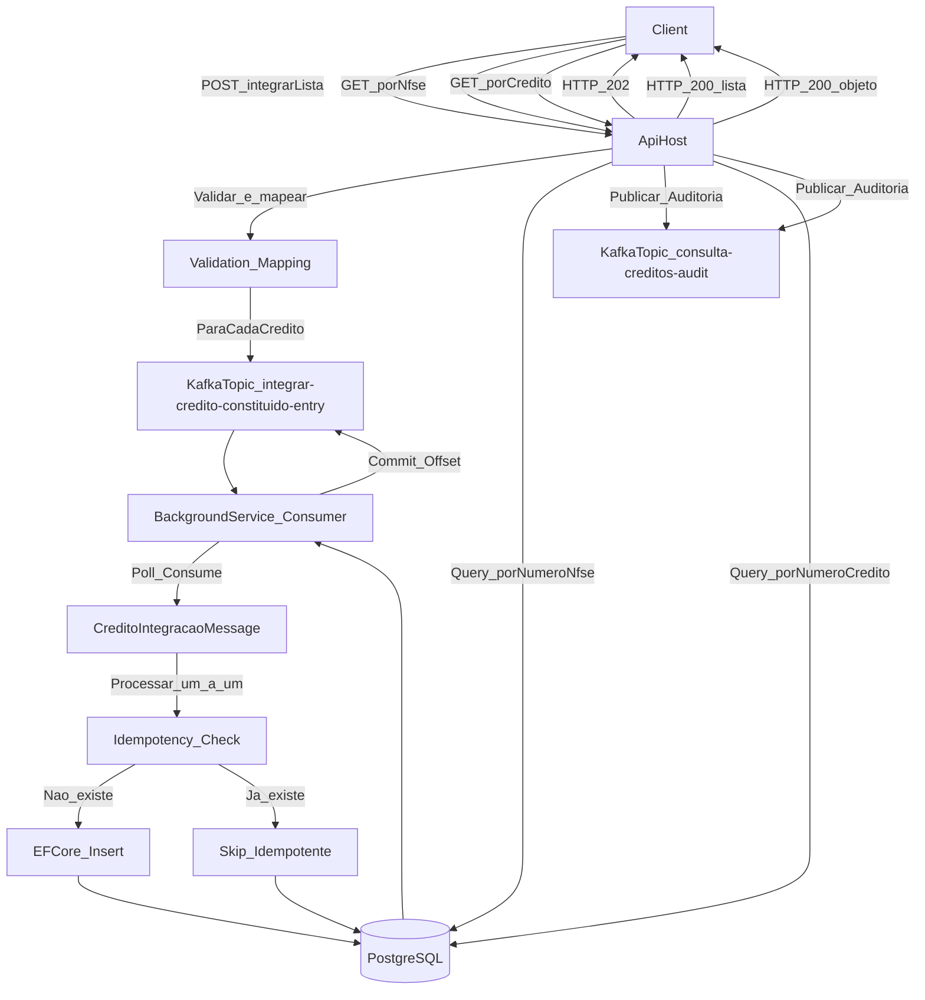
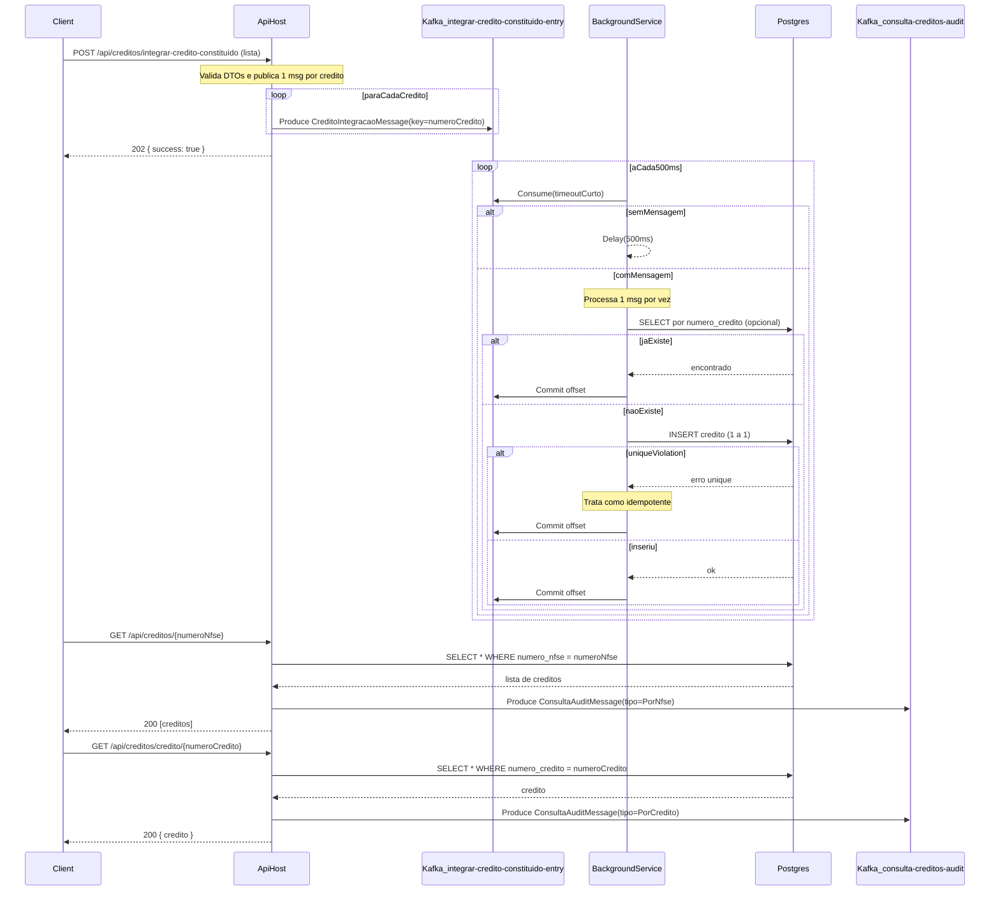

# Microserviço de Consulta de Créditos ISSQN

Microserviço desenvolvido em .NET 6 para integração, processamento assíncrono e consulta de créditos tributários (ISSQN), utilizando mensageria Kafka, Background Service e banco de dados PostgreSQL.

## Arquitetura

O sistema é composto por um único serviço ASP.NET Core que hospeda:

- **API REST** para receber integrações e servir consultas
- **BackgroundService** (consumer Kafka) para processar mensagens assíncronas
- **Persistência relacional** via EF Core + PostgreSQL
- **Health checks** expostos em `/self` e `/ready`

### Componentes Principais

- **API**: Controllers + UseCases para orquestração de requisições
- **Publisher**: Publica mensagens de integração no POST e auditoria nos GET
- **Consumer**: BackgroundService consumindo Kafka com polling de 500ms
- **Repositórios**: Abstraem acesso ao banco de dados via EF Core

## Diagramas

### Diagrama de Fluxo

O diagrama abaixo ilustra o fluxo completo do sistema, desde a recepção de requisições até a persistência e consulta de dados:



### Diagrama de Sequência

O diagrama de sequência detalha as interações entre os componentes do sistema:



## Tecnologias Utilizadas

- **.NET 6** (C#, ASP.NET Core)
- **Entity Framework Core 6.0** com PostgreSQL
- **Kafka** (Confluent.Kafka 2.3.0)
- **Docker** e **Docker Compose**
- **xUnit** para testes unitários
- **Moq** e **FluentAssertions** para testes

## Pré-requisitos

- Docker e Docker Compose instalados
- .NET 6 SDK (opcional, para desenvolvimento local)

## Como Executar

### Usando Docker Compose (Recomendado)

1. Clone o repositório:
```bash
git clone <url-do-repositorio>
cd consulta-creditos-dotnet-6-backend
```

2. Execute o docker-compose:
```bash
docker-compose up -d
```

3. Aguarde alguns segundos para os serviços iniciarem. Você pode verificar os logs:
```bash
docker-compose logs -f api
```

4. A API estará disponível em `http://localhost:8080`
5. Kafka UI estará disponível em `http://localhost:8081` (opcional)

### Executando Localmente (Desenvolvimento)

1. Certifique-se de que PostgreSQL e Kafka estão rodando:
   - PostgreSQL: `localhost:5432`
   - Kafka: `localhost:9092`

2. Configure as variáveis de ambiente ou edite `appsettings.json`:
```json
{
  "ConnectionStrings": {
    "Postgres": "Host=localhost;Port=5432;Database=consultacreditos;Username=postgres;Password=postgres"
  },
  "Kafka": {
    "BootstrapServers": "localhost:9092",
    "Topics": {
      "Integracao": "integrar-credito-constituido-entry",
      "Auditoria": "consulta-creditos-audit"
    }
  }
}
```

3. Execute a aplicação:
```bash
cd src/ConsultaCreditos.Api
dotnet run
```

## Endpoints da API

### POST /api/creditos/integrar-credito-constituido

Integra uma lista de créditos constituídos na base de dados. Publica uma mensagem por crédito no tópico Kafka.

**Request Body:**
```json
[
  {
    "numeroCredito": "123456",
    "numeroNfse": "7891011",
    "dataConstituicao": "2024-02-25",
    "valorIssqn": 1500.75,
    "tipoCredito": "ISSQN",
    "simplesNacional": "Sim",
    "aliquota": 5.0,
    "valorFaturado": 30000.00,
    "valorDeducao": 5000.00,
    "baseCalculo": 25000.00
  },
  {
    "numeroCredito": "789012",
    "numeroNfse": "7891011",
    "dataConstituicao": "2024-02-26",
    "valorIssqn": 1200.50,
    "tipoCredito": "ISSQN",
    "simplesNacional": "Não",
    "aliquota": 4.5,
    "valorFaturado": 25000.00,
    "valorDeducao": 4000.00,
    "baseCalculo": 21000.00
  }
]
```

**Response:** `202 Accepted`
```json
{
  "success": true
}
```

### GET /api/creditos/{numeroNfse}

Retorna uma lista de créditos constituídos com base no número da NFS-e.

**Response:** `200 OK`
```json
[
  {
    "numeroCredito": "123456",
    "numeroNfse": "7891011",
    "dataConstituicao": "2024-02-25",
    "valorIssqn": 1500.75,
    "tipoCredito": "ISSQN",
    "simplesNacional": "Sim",
    "aliquota": 5.0,
    "valorFaturado": 30000.00,
    "valorDeducao": 5000.00,
    "baseCalculo": 25000.00
  }
]
```

### GET /api/creditos/credito/{numeroCredito}

Retorna os detalhes de um crédito constituído específico com base no número do crédito.

**Response:** `200 OK`
```json
{
  "numeroCredito": "123456",
  "numeroNfse": "7891011",
  "dataConstituicao": "2024-02-25",
  "valorIssqn": 1500.75,
  "tipoCredito": "ISSQN",
  "simplesNacional": "Sim",
  "aliquota": 5.0,
  "valorFaturado": 30000.00,
  "valorDeducao": 5000.00,
  "baseCalculo": 25000.00
}
```

**Response (não encontrado):** `404 Not Found`

## Health Checks

### GET /self

Verifica se o processo está de pé (liveness).

**Response:** `200 OK` se o processo estiver rodando

### GET /ready

Verifica se as dependências críticas estão disponíveis (readiness):
- PostgreSQL
- Kafka

**Response:** `200 OK` se todas as dependências estiverem disponíveis

## Testes

Para executar os testes unitários:

```bash
dotnet test
```

Os testes cobrem:
- Use cases (integração e consulta)
- Mapeamento de DTOs
- Conversão de `simplesNacional` (string ↔ bool)

## Estrutura do Projeto

```
consulta-creditos-dotnet-6-backend/
├── src/
│   ├── ConsultaCreditos.Api/          # Host ASP.NET Core
│   │   ├── Controllers/               # Endpoints REST
│   │   ├── HostedServices/            # BackgroundService consumer
│   │   ├── HealthChecks/              # Health check customizados
│   │   └── Program.cs                 # Configuração e DI
│   ├── ConsultaCreditos.Application/  # Casos de uso e DTOs
│   │   ├── UseCases/                  # Lógica de negócio
│   │   ├── Ports/                     # Interfaces (repositórios, publishers)
│   │   ├── DTOs/                      # Data Transfer Objects
│   │   └── Mapping/                   # Mapeamento DTO ↔ Domain
│   ├── ConsultaCreditos.Domain/        # Entidades de domínio
│   │   └── Entities/                  # Credito
│   └── ConsultaCreditos.Infrastructure/ # Implementações
│       ├── Persistence/                # EF Core (DbContext, migrations)
│       ├── Repositories/               # Implementação de repositórios
│       └── Messaging/                  # Kafka (publishers, consumer factory)
│           ├── Contracts/              # Mensagens Kafka
│           └── Kafka/                 # Implementações Kafka
├── tests/
│   └── ConsultaCreditos.UnitTests/    # Testes unitários
├── docker-compose.yml                  # Orquestração de containers
├── Dockerfile                          # Build da aplicação
└── README.md                           # Este arquivo
```

## Decisões Arquiteturais

### Idempotência

A idempotência é garantida através de:
1. **Índice único** em `numero_credito` no banco de dados
2. **Verificação prévia** de existência antes de inserir (otimização)
3. **Tratamento de exceções** de violação de unique constraint como sucesso idempotente

### Mensageria

- **Producer Kafka** configurado como Singleton (recomendação do Confluent.Kafka)
- **Consumer** com `EnableAutoCommit=false` e commit manual após processamento
- **Polling de 500ms** conforme especificação do desafio
- **Processamento 1 a 1** (sem bulk) conforme requisito

### Background Service

- Consome mensagens do tópico `integrar-credito-constituido-entry`
- Processa uma mensagem por vez
- Em caso de erro, faz commit para não travar o consumer (em produção, considerar dead-letter queue)

### Auditoria

- Toda consulta (GET) publica um evento no tópico `consulta-creditos-audit`
- Permite rastreabilidade e análise posterior sem acoplar a API a outros sistemas

## Observabilidade

- Logs estruturados com contexto (numeroCredito, offset, partition)
- Health checks expostos para monitoramento
- Tratamento de erros com logs detalhados

## Próximos Passos (Melhorias Futuras)

- Implementar dead-letter queue para mensagens com falha após N tentativas
- Adicionar testes de integração
- Adicionar **cache com Redis** nos endpoints **GET** de créditos (`GET /api/creditos/{numeroNfse}` e `GET /api/creditos/credito/{numeroCredito}`) para reduzir latência e carga no PostgreSQL (com estratégia de invalidação/TTL)
- Desacoplar os **Background Services** (consumers Kafka) do host da API, separando em um **Worker Service**/deployment próprio para permitir **escalabilidade independente** (API scale-out vs consumers scale-out)
- Implementar rate limiting na API
- Adicionar autenticação/autorização se necessário

## Licença

Este projeto foi desenvolvido como parte de um desafio técnico.

